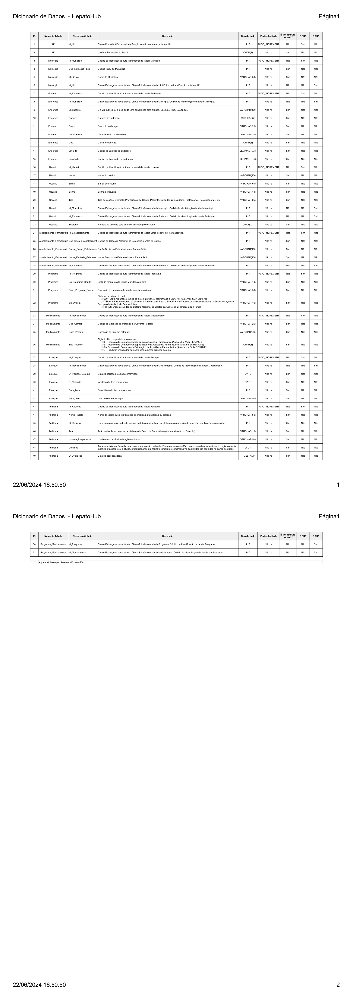

# Projeto HepatoHub

### Descrição do Projeto
Esse projeto utiliza dados públicos do Ministério da Saúde sobre medicamentos específicos para o tratamento de doenças hepáticas. A plataforma, atualmente em desenvolvimento, permite que os usuários pesquisem por doenças hepáticas específicas ou por medicamentos, fornecendo informações básicas sobre os medicamentos disponíveis, localização e regras de aquisição, dentre outras informações relevantes.

Além disso, a plataforma também serve como uma referência confiável para a divulgação de artigos e outros conteúdos relevantes na área da saúde hepática.

# Banco de Dados hepatohub_bd

Um banco de dados bem-estruturado é fundamental para organizar e armazenar informações de forma eficiente, garantindo acesso rápido, confiabilidade e integridade dos dados. Ele proporciona uma base sólida para aplicações e sistemas, facilitando a recuperação precisa de informações, a análise de dados e a geração de relatórios. Além disso, um banco de dados bem projetado ajuda na redução de redundâncias e inconsistências, melhorando a qualidade dos dados e facilitando a manutenção ao longo do tempo. Isso resulta em sistemas mais robustos, escaláveis e menos propensos a erros, promovendo a eficiência operacional e a tomada de decisões baseadas em dados confiáveis. Diante deste contexto, neste trabalho tomamos o cuidado para contemplar todas as exigência para obtermos um Banco de Dados de qualidade.

### Modelagem Conceitual

Na modelagem conceitual de banco de dados, o foco está na representação abstrata das entidades, seus atributos e relacionamentos sem detalhes de implementação. Essa fase permite capturar a estrutura essencial do banco de dados, garantindo uma compreensão clara das entidades envolvidas e como estão inter-relacionadas, o  que é essencial para o projeto de um banco de dados eficiente, bem estruturados e representativo.

  

### Normalização e Modelagem Lógica

Uma normalização minimamente recomendada é a 3ª Forma Normal. Vejamos as condições para atendimento da 1ª, 2ª e 3ª Forma Normal:
ª Forma Normal (1FN): É uma condição na qual os dados de uma tabela de banco de dados estão organizados em colunas com tipos de dados definidos, e cada coluna contém apenas valores atômicos (indivisíveis). Isso significa que não deve haver conjuntos repetitivos de valores ou estruturas complexas em uma única coluna.

2ª Forma Normal (2FN): Uma tabela está na 2ª Forma Normal quando atende às exigências da 1ª Forma Normal e, além disso, todos os atributos não chave são totalmente dependentes da chave primária. Isso significa que nenhum atributo deve depender apenas de uma parte da chave primária, mas sim da chave inteira.

3ª Forma Normal (3FN): Uma tabela está na 3ª Forma Normal se estiver na 2ª Forma Normal e todos os atributos não chave são transitivamente dependentes apenas da chave primária. Em outras palavras, não deve haver dependências transitivas não triviais entre os atributos não chave.

Feito isso, avança-se para a Modelagem Lógica.
Modelagem Lógica: Refere-se à representação estruturada e detalhada de um banco de dados, utilizando modelos de dados que especificam como os dados são armazenados e organizados. A modelagem lógica envolve a tradução da modelagem conceitual (como o Modelo Entidade-Relacionamento) em um modelo de dados específico do sistema de gerenciamento de banco de dados (SGBD), como esquemas de tabelas normalizados, tipos de dados, relacionamentos e restrições.

  

### Modelagem Física

A modelagem física em bancos de dados é o processo de traduzir o modelo lógico de dados em estruturas físicas específicas dentro de um Sistema de Gerenciamento de Banco de Dados (SGBD). Isso inclui a definição de tabelas, índices, chaves primárias e estrangeiras, restrições de integridade, tipos de dados detalhados e otimizações de desempenho. O objetivo da modelagem física é garantir que o banco de dados seja eficiente, seguro e capaz de atender aos requisitos de armazenamento e recuperação de dados da aplicação de forma adequada.
Nesse contexto, um dos diagrmas mais relevantes é o Diagrama EER (Diagrama Entidade-Relacionamento Estendido).

**Importância do Diagrama EER**

O Diagrama EER é crucial no desenvolvimento de bancos de dados porque, dentre outros aspectos relevantes:

**Visualização Clara**: Facilita a compreensão das estruturas de dados e das relações complexas entre entidades.

**Projeto Eficiente**: Ajuda os designers a identificar requisitos de dados, estabelecer restrições de integridade e definir as estruturas físicas do banco de dados.

**Comunicação**: Serve como uma ferramenta de comunicação entre os stakeholders, incluindo desenvolvedores, analistas e clientes, para garantir que todos tenham uma compreensão compartilhada do modelo de dados.

**Base para Implementação**: Fornece a base para a criação física do banco de dados usando um Sistema de Gerenciamento de Banco de Dados (SGBD), como MySQL, PostgreSQL ou Oracle.

Em resumo, o Diagrama EER é essencial para a modelagem de dados eficiente e precisa, permitindo aos desenvolvedores criar bancos de dados que atendam às necessidades específicas de uma aplicação ou sistema.

  

**Banco de Dados implementado**
A seguir é exibida uma cópia de tela do Banco de Dados implementado utilizando o MySQL WorkBench.

  

**Tabelas**
>
>**Medicamento**: Armazena informações sobre os medicamentos.
>
>**Programa**: Contém dados sobre os programas de saúde relacionados aos medicamentos.
>
>**Programa_Medicamento**: Tabém que representa o relacionamento N:N das tabelas Medicamento e Programa.
>
>**Estoque**: Registra as informações de estoque dos medicamentos.
>
>**Uf**: Armazena dados sobre unidades federativas.
>
>**Municipio**: Armazena dados sobre as cidades.
>
>**Endereco**: Guarda informações sobre endereços.
>
>**Usuario**: Contém dados dos usuários da plataforma.
>
>**Estabelecimento_Farmaceutico**: Armazena informações sobre os estabelecimentos farmacêuticos.
>
>**Auditoria**: A tabela Auditoria registra todas as operações de inserção, atualização e exclusão realizadas nas tabelas principais para garantir a rastreabilidade e segurança dos dados.

**Dicionário de Dados**

Um Dicionário de Dados é fundamental na gestão e desenvolvimento de sistemas de informação, pois ele atua como um guia completo e estruturado que define todos os elementos de dados utilizados no contexto de um projeto. A importância reside em sua capacidade de oferecer uma fonte única de verdade sobre a estrutura, definição, significado e relacionamentos dos dados dentro de um sistema. Isso facilita a comunicação entre os membros da equipe técnica e os stakeholders, assegura a consistência e precisão dos dados ao longo do ciclo de vida do sistema, e contribui para a manutenção, evolução e documentação eficazes do sistema de informação.

## Dicionário de Dados

| ID | Nome da Tabela               | Nome do Atributo         | Descrição                                                                 | Tipo de dado | Particularidade | É um atributo normal*? | É PK? | É FK? |
|----|------------------------------|--------------------------|---------------------------------------------------------------------------|--------------|-----------------|-------------------------|-------|-------|
| 1  | Uf                           | Id_Uf                    | Chave-Primária. Código de Identificação auto-incremental da tabela Uf.    | INT          | AUTO_INCREMENT  | Não                     | Sim   | Não   |
| 2  | Uf                           | Uf                       | Unidade Federativa do Brasil                                              | CHAR(2)      | Não há          | Sim                     | Não   | Não   |
| 3  | Município                    | Id_Municipio             | Código de Identificação auto-incremental da tabela Município.              | INT          | AUTO_INCREMENT  | Não                     | Sim   | Não   |
| 4  | Município                    | Cod_Municipio_Ibge       | Código IBGE do Município                                                  | INT          | Não há          | Sim                     | Não   | Não   |
| 5  | Município                    | Município                | Nome do Município                                                         | VARCHAR(50)  | Não há          | Sim                     | Não   | Não   |
| 6  | Município                    | Id_Uf                    | Chave-Estrangeira nesta tabela. Chave-Primária na tabela Uf.               | INT          | Não há          | Não                     | Não   | Sim   |
| 7  | Endereço                     | Id_Endereco              | Código de Identificação auto-incremental da tabela Endereço.               | INT          | AUTO_INCREMENT  | Não                     | Sim   | Não   |
| 8  | Endereço                     | Id_Municipio             | Chave-Estrangeira nesta tabela. Chave-Primária na tabela Município.        | INT          | Não há          | Não                     | Não   | Sim   |
| 9  | Endereço                     | Logradouro               | Via pública ou local onde uma construção está situada.                     | VARCHAR(100) | Não há          | Sim                     | Não   | Não   |
| 10 | Endereço                     | Número                   | Número do endereço.                                                       | VARCHAR(7)   | Não há          | Sim                     | Não   | Não   |
| 11 | Endereço                     | Bairro                   | Bairro do endereço.                                                       | VARCHAR(25)  | Não há          | Sim                     | Não   | Não   |
| 12 | Endereço                     | Complemento              | Complemento do endereço.                                                  | VARCHAR(10)  | Não há          | Sim                     | Não   | Não   |
| 13 | Endereço                     | CEP                      | CEP do endereço.                                                          | CHAR(8)      | Não há          | Sim                     | Não   | Não   |
| 14 | Endereço                     | Latitude                 | Latitude do endereço.                                                     | DECIMAL(10, 8)| Não há        | Sim                     | Não   | Não   |
| 15 | Endereço                     | Longitude                | Longitude do endereço.                                                    | DECIMAL(10, 8)| Não há        | Sim                     | Não   | Não   |
| 16 | Usuário                      | Id_Usuário               | Código de Identificação auto-incremental da tabela Usuário.               | INT          | AUTO_INCREMENT  | Não                     | Sim   | Não   |
| 17 | Usuário                      | Nome                     | Nome do usuário.                                                          | VARCHAR(100) | Não há          | Sim                     | Não   | Não   |
| 18 | Usuário                      | Email                    | E-mail do usuário.                                                        | VARCHAR(50)  | Não há          | Sim                     | Não   | Não   |
| 19 | Usuário                      | Senha                    | Senha do usuário.                                                         | VARCHAR(14)  | Não há          | Sim                     | Não   | Não   |
| 20 | Usuário                      | Tipo                     | Tipo do usuário.                                                          | VARCHAR(25)  | Não há          | Sim                     | Não   | Não   |
| 21 | Usuário                      | Id_Município             | Chave-Estrangeira nesta tabela. Chave-Primária na tabela Município.        | INT          | Não há          | Não                     | Sim   | Não   |
| 22 | Usuário                      | Id_Endereço              | Chave-Estrangeira nesta tabela. Chave-Primária na tabela Endereço.         | INT          | Não há          | Não                     | Sim   | Não   |
| 23 | Usuário                      | Telefone                 | Número de telefone para contato, indicado pelo usuário.                   | CHAR(12)     | Não há          | Sim                     | Não   | Não   |
| 24 | Estabelecimento Farmacêutico | Id_Estabelecimento       | Código de Identificação auto-incremental da tabela Estabelecimento Farmacêutico.| INT | AUTO_INCREMENT | Não                   | Sim   | Não   |
| 25 | Estabelecimento Farmacêutico | Cod_Cnes_Estabelecimento | Código do Cadastro Nacional de Estabelecimentos de Saúde.                | INT          | Não há          | Sim                     | Não   | Não   |
| 26 | Estabelecimento Farmacêutico | Razão Social Estabelecimento | Razão Social do Estabelecimento Farmacêutico.                         | VARCHAR(100) | Não há     | Sim                     | Não   | Não   |
| 27 | Estabelecimento Farmacêutico | Nome Fantasia Estabelecimento | Nome Fantasia do Estabelecimento Farmacêutico.                         | VARCHAR(100) | Não há     | Sim                     | Não   | Não   |
| 28 | Estabelecimento Farmacêutico | Id_Endereço              | Chave-Estrangeira nesta tabela. Chave-Primária na tabela Endereço.         | INT          | Não há          | Não                     | Não   | Sim   |
| 29 | Programa                     | Id_Programa              | Código de Identificação auto-incremental da tabela Programa.               | INT          | AUTO_INCREMENT  | Não                     | Sim   | Não   |
| 30 | Programa                     | Sg_Programa_Saúde        | Sigla do programa de Saúde vinculado ao item.                             | VARCHAR(10)  | Não há          | Sim                     | Não   | Não   |
| 31 | Programa                     | Desc_Programa_Saúde      | Descrição do programa de saúde vinculado ao item.                         | VARCHAR(50)  | Não há          | Sim                     | Não   | Não   |
| 32 | Programa                     | Sg_Origem                | Sistema de origem do dado.                                                | VARCHAR(10)  | Não há          | Sim                     | Não   | Não   |
| 33 | Medicamento                  | Id_Medicamento           | Código de Identificação auto-incremental da tabela Medicamento.            | INT          | AUTO_INCREMENT  | Não                     | Sim   | Não   |
| 34 | Medicamento                  | Cod_Catmat               | Código do Catálogo de Materiais do Governo Federal.                       | VARCHAR(25)  | Não há          | Sim                     | Não   | Não   |
| 35 | Medicamento                  | Desc_Produto             | Descrição do item em estoque.                                             | VARCHAR(255) | Não há          | Sim                     | Não   | Não   |
| 36 | Medicamento                  | Tipo_Produto             | Sigla do Tipo do produto em estoque.                                       | CHAR(1)      | Não há          | Sim                     | Não   | Não   |
| 37 | Estoque                      | Id_Estoque               | Código de Identificação auto-incremental da tabela Estoque.                | INT          | AUTO_INCREMENT  | Não                     | Sim   | Não   |
| 38 | Estoque                      | Id_Medicamento           | Chave-Estrangeira nesta tabela. Chave-Primária na tabela Medicamento.      | INT          | Não há          | Não                     | Não   | Sim   |
| 39 | Estoque                      | Dt_Posicao_Estoque       | Data da posição de estoque informada.                                      | DATE         | Não há          | Sim                     | Não   | Não   |
| 40 | Estoque                      | Dt_Validade              | Validade do Item em estoque.                                               | DATE         | Não há          | Sim                     | Não   | Não   |
| 41 | Estoque                      | Qtde_Itens               | Quantidade do item em estoque.                                             | INT          | Não há          | Sim                     | Não   | Não   |
| 42 | Estoque                      | Num_Lote                 | Lote do item em estoque.                                                  | VARCHAR(50)  | Não há          | Sim                     | Não   | Não   |
| 43 | Auditoria                    | Id_Auditoria             | Código de Identificação auto-incremental da tabela Auditoria.              | INT          | AUTO_INCREMENT  | Não                     | Sim   | Não   |
| 44 | Auditoria                    | Nome_Tabela              | Nome da tabela que sofreu a ação de inserção, atualização ou deleção.     | VARCHAR(50)  | Não há          | Sim                     | Não   | Não   |
| 45 | Auditoria                    | Id_Registro              | Representa o identificador do registro na tabela original que foi afetado pela operação de inserção, atualização ou exclusão. | INT | Não há | Sim | Não   | Não   |
| 46 | Auditoria                    | Acao                     | Ação realizada em alguma das tabelas do Banco de Dados (Inserção, Atualização ou Deleção). | VARCHAR(15) | Não há | Sim | Não   | Não   |
| 47 | Auditoria                    | Usuario_Responsavel      | Usuário responsável pela ação realizada.                                   | VARCHAR(50)  | Não há          | Sim                     | Não   | Não   |
| 48 | Auditoria                    | Detalhes                 | Armazena informações adicionais sobre a operação realizada. Armazena um JSON com os detalhes específicos do registro que foi inserido, atualizado ou excluído, proporcionando um registro completo e compreensível das mudanças ocorridas no banco de dados. | JSON | Não há | Sim | Não   | Não   |
| 49 | Auditoria                    | Dt_Alteracao             | Data da ação realizada.                                                    | TIMESTAMP    | Não há          | Sim                     | Não   | Não   |
| 50 | Programa_Medicamento         | Id_Programa              | Chave-Estrangeira nesta tabela. Chave-Primária na tabela Programa.         | INT          | Não há          | Não                     | Não   | Sim   |
| 51 | Programa_Medicamento         | Id_Medicamento           | Chave-Estrangeira nesta tabela. Chave-Primária na tabela Medicamento.      | INT          | Não há          | Não                     | Não   | Sim   |

* Aquele atributo que não é nem PK nem FK

  

